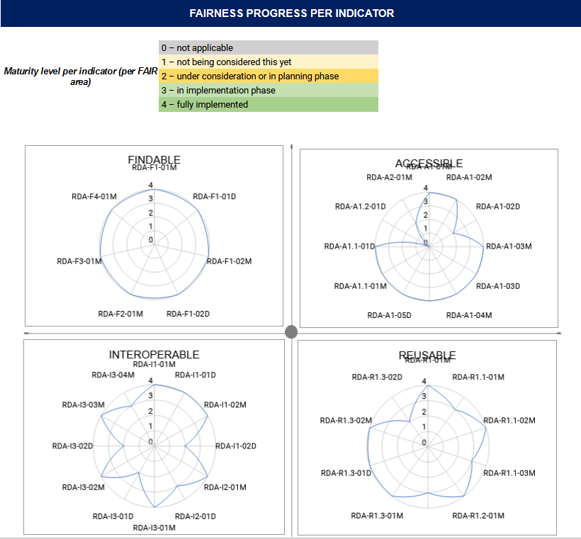

.. _fair_enabled:

FAIR enabled
============

The OpenAIRE and DRIVER guidelines, at the beginning of their time in `2006 <https://www.openaire.eu/history>`_, had already put the focus on elements that can be found today in the FAIR principles.
Community-based refinement and enhancement of the guidelines over time to include elements with their descriptions that are consistent with motivation of FAIR. 
The following section describe the FAIRification process of the OpenAIRE Guidelines for institutional & thematic Repository Manager.

.. _fair_overview:

Overview
~~~~~~~~

The `FAIR maturity model: specification and guidelines <https://www.rd-alliance.org/group/fair-data-maturity-model-wg/outcomes/fair-data-maturity-model-specification-and-guidelines-0>`_ of the `Research Data Alliance (RDA) <https://www.rd-alliance.org>`_ (DOI: `10.15497/rda00050 <https://doi.org/10.15497/rda00050>`_)
has the aim to specify the objective indicators for the FAIR assessment. The guidelines are intended to assist evaluators to implement the indicators in the evaluation approach or tool 
they manage.

The evaluation level analyse is done thru the RDA provided sheet at `https://www.rd-alliance.org/system/files/FAIR_evaluation_levels_v0.01.xlsx`_. 
The result of this evaluation shows the figure below.

